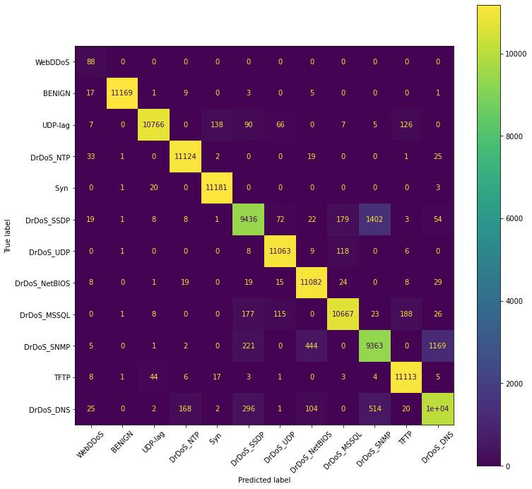

##Deep Learning Based Intrusion Detection 

Example output:

Accuracy ratios for each class
WebDDoS      = 1.0
BENIGN       = 0.9967871485943776
UDP-lag      = 0.9608210620258814
DrDoS_NTP    = 0.9927710843373494
Syn          = 0.9978580990629183
DrDoS_SSDP   = 0.842124051762606
DrDoS_UDP    = 0.9873270861222668
DrDoS_NetBIOS= 0.9890227576974565
DrDoS_MSSQL  = 0.9519857206604194
DrDoS_SNMP   = 0.8356091030789826
TFTP         = 0.991789379741187
DrDoS_DNS    = 0.8989736724676484

### Please cite below works if you find it useful:
[Akgun, Devrim, Selman Hizal, and Unal Cavusoglu. "A new DDoS attacks intrusion detection model based on deep learning for cybersecurity." Computers & Security 118 (2022): 102748 (https://www.researchgate.net/publication/360327782_A_New_DDoS_Attacks_Intrusion_Detection_Model_Based_on_Deep_Learning_for_Cybersecurity)

[Hizal, Selman, Ünal ÇAVUŞOĞLU, and Devrim AKGÜN. "A New Deep Learning Based Intrusion Detection System for Cloud Security." 2021 3rd International Congress on Human-Computer Interaction, Optimization and Robotic Applications (HORA). IEEE, 2021](https://www.researchgate.net/publication/352811809_A_new_Deep_Learning_Based_Intrusion_Detection_System_for_Cloud_Security)
